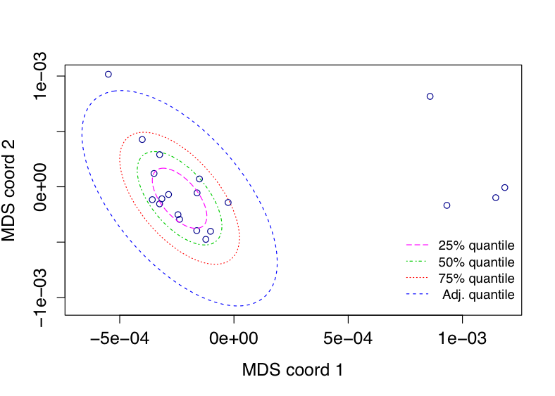

<style>
pre {
  overflow-x: auto;
}
pre code {
  word-wrap: normal;
  white-space: pre;
}
</style>

```{r global_options, include=FALSE}
options(width = 999)
knitr::opts_chunk$set(fig.align='center', fig.width=5.5, fig.height=4.5, message=FALSE)
```

## Introduction

Mass spectrometry is actively being used to discover proteomic patterns in complex mixtures of peptides derived from biological samples. Reproducibility is however a significant challenge in MALDI protein profiling. Approaches to improve the analytical performance of MALDI protein profiling include extensive pre-fractionation strategies, immunocapture, pre-structured target surfaces, standardized matrix (co)crystallization, improved instrument components, internal standard peptides, quality-control samples, among others [@Albrethsen2007]. Mass spectrometry (MS) data pre-processing algorithms play a crucial role in rendering the subsequent data analysis more robust and accurate. The package `MALDIrppa` contributes a number of procedures for robust pre-processing and analysis, along with a number of functions to facilitate common data management operations. It is thought to work in conjunction with the `MALDIquant` package [@Gibb2012], using object classes and methods from this latter. These notes provide basic guidelines for users to run a complete robust MALDI mass spectra pre-processing pipeline using their own data with small adaptations. Further specific details and examples on the full functionality of the `MALDIrppa` package can be found in the associated help pages.

The data set `spectra` used as example here is an anonymised collection of mass spectra trimmed to the [2500, 13000] _m/z_ interval. Their _m/z_ resolution is 30 times lower than the original (achieved using the `redResolution` function) so as to make it manageable for sharing and illustration purposes. It consists of 4 technical replicates of 5 biological replicates from 20 bacterial isolates. The mass spectra were originally acquired over the [2000, 20000] Daltons mass range using the Bruker Daltonics Ultraflex II mass spectrometer. The data set `type` contains a simplified version of the associated metadata.

The following sections go through the stages to transform raw mass spectra into formats suitable for downstream data analysis and modelling for biological interpretation. These involve data transformation, smoothing, baseline correction, normalisation, peak detection and peak alignment and binning. The features of the signals depend on technological progress and characteristics of the species under study. Unfortunately there is not a standard methodology for MS data pre-processing best working in all cases. This document illustrates a generic pipeline through `MALDIrppa` in combination with `MALDIquant` based on robust statistical methods which contributes to lessen the intrinsic reproducibility issues with MS data and facilitates obtaining reliable biological conclusions [@Mclean2017]. However, the finest pre-processing in a particular case might require further discussion of choices for parameter settings and methods.

## Getting started

The data are included in `MALDIrppa` in the own R's `RData` binary file format. They can be loaded into the workspace using the `data` function.

```{r loading, echo=TRUE, eval=TRUE, results='hide'}
library(MALDIrppa)
```

```{r loading2, echo=TRUE, eval=TRUE, results='hide'}
data(spectra) # list of MassSpectra class objects
data(type)    # metadata matrix
```

Alternatively, raw data stored in text files can be easily imported into R and given the convenient `MassSpectrum` class format using the `importSpectra` function. The function `summarySpectra` computes a table including some basic summary statistics. A look at these along with some graphical representations are useful to get a first insight into the data set and identify possible issues. The next code shows numerical results for the first 10 signals.

```{r summary, echo=TRUE, eval=TRUE}
summarySpectra(spectra[1:10])
```

A number of parameters are required to be set for the different pre-processing stages. The functions include _safe_ default values, but parameter settings throughout pre-processing stages interact in complex ways. Using simulation, we customised some of the key parameter so as to obtain optimal combinations in terms of sensibility and false discovery rate in peak profiles. They have been slightly modified to accommodate the characteristics of the reduced example data set used here. It is convenient to write an initial section in the pre-processing pipeline script to set the values for the parameters which will be used later on. This facilitates testing results from different settings.

```{r parameters, echo=TRUE, eval=TRUE}
# Pre-processing parameter settings
thScale <- 2.5 # Smoothing
ite <- 105 # Baseline correction
SigNoi <- 2 # Peak extraction
hws <- 20 # Peak extraction
tol <- 0.003 # Peak binning
```

## Initial screening

Pre-processing methods are not immune to low-quality mass spectra and inadvertently letting them through can severely distort the results. For example, when dealing with a number of data sets we observed both clusters of spurious peaks in some cases and sparse peaks in others which interfere with the determination of common reference peaks for peak alignment and binning. Common low-quality mass spectra are characterised by extremely ripply and indented profiles due to low signal intensities. The low signal intensity causes poor peak formation and poorly resolved peaks. Moreover, ion suppression cases show one or a few abnormally high peaks whereas the other peptide features are pulled down. The package `MALDIrppa` helps to detect exotic signals by a semi-automatic screening process implemented in the `screenSpectra` function. It is based on robust scale estimators [@Rousseeuw1993] of the derivative mass spectra and median intensities. These components are given a weight to build an atypicality score ($A$) for each signal, which is then labelled as a suspicious case (`failure`) if the score falls beyond the estimated tolerance limits (see help for `screenSpectra` for options available). The atypicality score $A$ is calculated as

$$A = \frac{S^{\lambda}}{(\texttt{med}+1)^{(1-\lambda)/2}},$$

where $S$ is the robust scale estimator used (either Rousseeuw's $Q$ or the well-known median absolute deviance, MAD, estimator are available), $\texttt{med}$ is the median intensity of the raw signal and $\lambda$ distributes the weight given to each of these components ($\lambda = 1/2$ by default).

The `screenSpectra` function generates a table `est.table` with individual information for each mass spectrum. The following code illustrates its use with default settings and creates a new `scSpectra` class object called `sc.results`. The function can take a matrix of metadata (`type` in our case) as argument. This is convenient to easily filter problematic cases out in both the spectra and metadata sets for subsequent analysis. Ordinary R methods `summary` and `plot` can be applied on `scSpectra` class objects to obtain a summary table and graphs of the results.

```{r iniscreening, echo=TRUE, eval=TRUE, fig.align='center', fig.width=5.5, fig.height=4.5}
sc.results <- screenSpectra(spectra, meta = type)
summary(sc.results)
plot(sc.results, labels = TRUE)
```

Among other features, the method `plot` allows to visualise the distribution of the atypicality scores (`type = "hist"`), customise the point labels and interactively display marked spectra for individual visual inspection (`type = "casewise"`). When `label = TRUE` it shows the position index of the mass spectra in the data set. It is advisable to visually inspect marked mass spectra, particular borderline cases, and further investigate any pattern. For example, in our illustrative data set we observe that mass spectra number 25 to 28 correspond to a series of technical replicates within the same biological replicates (see e.g. `type[20:30,]`). Focusing on some of the most extreme $A$ scores, the following figures display mass spectra 28, 29 and 87, which correspond with low signal intensity, ion suppression and flatline mass spectra respectively. Flatline mass spectra are produced when the instrument is unable to collect data that does not meet the minimum resolution and intensity requirements. These low-quality mass spectra are clearly identified using the $A$ score as seen above.

```{r spectraplots10, echo=TRUE, eval=TRUE, fig.align='center'}
plot(spectra[[28]])
plot(spectra[[29]])
plot(spectra[[87]])
```

As an example of the problems caused by faulty, low-quality spectra, the next figure shows the case of two peak profiles originated from the same biological material. It is evident that they are carrying very different information.

<center>
</center>

For the purpose of this tutorial we move on by updating the original `spectra` and `type` objects with the filtered collection of mass spectra and associated metadata provided by `screenSpectra` through the `fspectra` and `fmeta` elements of the output.

```{r iniscreening3, echo=TRUE, eval=TRUE}
spectra <- sc.results$fspectra # Filtered list of mass spectra
type <- sc.results$fmeta # Filtered metadata
```

## Denoising, baseline correction and normalisation

Signal denoising or smoothing is conducted in `MALDIrppa` by undecimated discrete wavelet transform (UDWT) [@Coombes2005] using the `wavSmooting` function. Wavelets adapt well to changes in peak shape and the UDWT produces the same results if the start of the signal is shifted by a few time points (shift-invariance). This prevents from undesirable artifacts into the signal near either end of the spectrum due to large changes in wavelet coefficients as a consequence of small shifts in location. In this case, smoothing is applied on square root-transformed (`sqrt` function in R) signals using `transfIntensity` for variance stabilisation. This function allows to apply any sensible user-defined transformation on the signal intensities. For baseline correction, the statistics-sensitive non-linear iterative peak-clipping (SNIP) algorithm as implemented in `MALDIquant` generates positive intensities and provides better results with high matrix effects (pronounced mode). Regarding signal normalisation, `MALDIquant` offers a number of sensible methods through the `calibrateIntensity` function. In particular, probabilistic quotient normalisation (PQN) provides a robust method for scaling spectra, commonly originated from different dilutions, into a common overall concentration [@Diet2006].

```{r deno, echo=TRUE, eval=TRUE}
spectra <- transfIntensity(spectra, fun = function(x) sqrt(x))
spectra <- wavSmoothing(spectra, thresh.scale = thScale)
spectra <- removeBaseline(spectra, method = "SNIP", iterations = ite)
spectra <- calibrateIntensity(spectra, method = "PQN")
```

Note that in this illustrative pipeline we go on overwriting the `MassSpectrum` object containing the list of signals as we apply the different operations to produce a clean and corrected collection of signals. Given the usual large size of the data set, this is convenient to save computer memory and speed up the process. However we do not then keep individual backup copies of the spectra at each pre-processing stage. If this is required, simply using the ordinary `save(objectname, filename)` line in R after each stage will do. In any case, it is recommended to delete previous versions of the data from R's workspace as soon as they are saved in order to prevent from memory usage problems.

## Peak extraction and alignment

Using `detectPeaks` in `MALDIquant` peak profiles are produced by searching for and extracting local maximum intensities along the corrected MS signals. A noise function is estimated (see `estimateNoise`) and signal-to-noise ratio (SNR) and mass window size values are set in order to determine peaks corresponding to genuine peptide-induced signals. In particular, peaks are extracted if their intensity is greater than SNR times the estimated noise within a mass $\pm$ half window size interval. Extracted peak lists still require alignment and binning across profiles. This is necessary to correct for slight mass drifts and arrange all peak profiles onto a common range of masses. A number of landmark peaks that are matched a minimum number of times across profiles serve as reference points for alignment, following procedures implemented in `MALDIquant` (the `minFreq` argument sets this as a proportion, 80\% frequency in our example). Binning is then used to equalise masses of peaks found within a tolerable relative mass deviation range and, hence, assumed to be representatives of the same peptide (the `tolerance` argument sets this as a proportion, 0.3\% deviance in our case). The `alignPeaks` function in `MALDIrppa` is a wrapper for a number of `MALDIquant` functions involved in this stage that simplifies the workflow into a single line of code. Moreover, `alignPeaks` implements an additional binning round which we found useful to deal with misalignment issues that may be still present after putting the peak profiles through default `MALDIquant` alignment and binning procedures. We faced this situation when working with mass spectra over a particularly high-resolution mass range.

```{r peaks, echo=TRUE, eval=TRUE}
peaks <- detectPeaks(spectra, SNR = SigNoi, halfWindowSize = hws)
peaks <- alignPeaks(peaks, minFreq = 0.8, tolerance = tol)
```

It is important to keep exploring the data throughout the pre-processing workflow in order to identify potential issues or unexpected results. Analogously to `summarySpectra` used above, `summaryPeaks` produces a table of summary statistics from the peak profiles. The following line of code shows for example details for the first 10 peak profiles.

```{r peakssummary, echo=TRUE, eval=TRUE}
summaryPeaks(peaks[1:10])
```

The function `countPeaks` directly counts the number of peaks in each profile. Either an obvious excess or scarcity of peaks in a profile may deserve a closer look. The following code produces the list of counts and plots them for overall comparison using the profile number as label.

```{r npeaks, echo=TRUE, eval=TRUE, fig.align='center'}
cP <- countPeaks(peaks)
plot(cP, type = "n")
text(cP, label = 1:length(cP))
```

At this point we have essentially concluded data pre-processing and it is then convenient to save a backup of the peak profiles and associate metadata.

```{r saving, echo=TRUE, eval=FALSE}
save(peaks, file = "peaks.pp.Rdata")
save(type, file = "type.pp.Rdata")
```

The `peakPatterns` function is useful to visualise and explore the resulting peak patterns. It displays peak presence (coloured cells) and absence (blank cells). The barplot on the top reflects the frequency of a peak across replicates. The function can be applied either on a list of `MassPeaks` objects, like our `peaks`, or on an intensity matrix. Any remaining data artifacts or hints about peak features differentiating e.g. strains should be evident here. This display can also be useful to check for homogeneity of replicates from an isolate by simply subsetting the replicates within that same isolate (see `?peakPatterns` for more details and examples).

```{r intmatrix, echo=TRUE, eval=TRUE, fig.align='center'}
peakPatterns(peaks)
```

## Outliers, filtering and merging replicates

Note that due to process disturbances, chemical contamination or human errors for example, some peak profiles may exhibit patterns beyond anticipated biological variability at a level at which certain homogeneity is expected, say at biological and technical replication level. This is not related to low-quality, data acquisition problems as before, the signals are correct, it is instead a case of outlying peak profiles characterised for its large distance from the main mass of data points. They usually include relevant information about certain artifacts or substructures in the data, although in practice it is not always straightforward to find the underlying reasons for their deviating behaviour. As it is well-known in general data modelling, outliers can heavily influence e.g. correlations, fitting in regression models or similarity measures used by classification algorithms. Outliers in our context are often sought after on a peptide-wise basis [@Erhard2012], but we adhere to the idea that peaks of outlying profiles do not necessarily stand out individually. They can simply show an atypical relative pattern with combinations of peaks that occur very rarely. Working within a robust statistics framework we consider the multidimensional and inter-dependent structure of the data for outlier detection [@Rocke1996; @Maronna2006]. In particular, we adapt the multivariate outlier detection method proposed by @Filzmoser2005 (adaptive outlier detection, AOD) which allows the boundaries for a peak profile to be considered as potential outlier to be adjusted to the number of replicates involved. By using a multidimensional scaling (MDS) coordinate projections of the data, the approach can be applied at different levels of replication and on varied data formats, e.g. either peak intensities or peak presence/absence binary data. This customised procedure is implemented in the `detectOutliers` function. It generates a logical vector flagging out potential outlying replicates at a given level of aggregation, e.g. at isolate level as set using the argument `by` in the following line of code. This can be used to filter outliers out if that is judged adequate. The argument `binary` facilitates the use of the method on either peak presence/absence profiles (`binary = TRUE`) or raw peak intensity profiles (`binary = FALSE`).

```{r outliers, echo=TRUE, eval=TRUE}
out <- detectOutliers(peaks, type$Isolate, binary = TRUE)
```

The following figure illustrates the result from a collection of 20 replicates from the same bacterial isolate. Note that the method was applied on peak presence/absence profiles. Quantile ellipsoids based on the robust Mahalanobis distance determine outlierness thresholds. The graph displays ellipsoids at increasing quantiles, including the adjusted quantile ellipsoid produced by the AOD method. The profiles, projected onto a 2-dimensional space by MDS, falling beyond the adjusted quantile boundaries were marked as potential outliers. In this case there is evidence of a set of 4 technical replicates within a biological replicate that were probably contaminated samples (distant points located on the right-hand side of the graph).

<center>
</center>

The identification of outliers can be sometimes a primary purpose of data analysis, as they might reveal hidden structures in the data of biological interest. Other times outliers are a nuisance resulting from errors or contamination, and it might be then convenient to discard or downweight them prior to the actual data modelling. `MALDIrppa` provides a exploratory tool to inform of samples that are considerably different from the majority. The final decision about their biological meaning and how to deal with them will depend on the assessment of the researcher. To simplify the exposition we here proceed by discarding outlying peak profiles.

```{r outliers2, echo=TRUE, eval=TRUE}
peaks.clean <- peaks[out[,2] == FALSE] # Discard outlying peak profiles
type.clean <- type[out[,2] == FALSE,]  # and corresponding metadata
```

The inherent nature of the data implies that pre-processed data may still contain peaks only reflecting noise and probably irrelevant signals. `MALDIquant` facilitates further cleaning by eliminating rare peaks across replicates using the `filterPeaks` function. This is done by setting a minimum frequency (`minFreq` argument) for a peak at a desired level of aggregation (isolate level in our case). Note that in `MALDIquant` the argument `labels` is used to set the grouping factor. The following line discards peaks occurring in less than 25\% replicates within isolate.

```{r filtering, echo=TRUE, eval=TRUE}
peaks.clean.f <- filterPeaks(peaks.clean, minFreq = 0.25, labels = type.clean$Isolate)
```

We can compare these filtered peak profiles with the more noisy raw peaks profiles above using `peakPatterns`.

```{r intmatrix2, echo=TRUE, eval=TRUE, fig.align='center'}
peakPatterns(peaks.clean.f)
```

Finally replicates are typically merged to obtain a single composite representative peak profile by isolate. In accordance with our robust approach we propose to do this by computing the median peak profile across replicates within isolate. This contributes to downgrade the influence of extreme peak intensities on the pooled estimates. The associated metadata should be also aggregated in the same way. Here we use the `aggregate` function available in R base, but other alternatives are available through several R packages. Note that we specify `FUN = length` simply as a _trick_, as we are not really interested in any summary of the metadata. Moreover, we only keep the information about the isolate, which is in the first column of the resulting table (note that in this illustrative example `type.clean.fm` becomes a vector after this).

```{r merge, echo=TRUE, eval=TRUE}
peaks.clean.fm <- mergeMassPeaks(peaks.clean.f, labels = type.clean$Isolate, method = "median")
type.clean.fm <- aggregate(type.clean, list(Isolate = type.clean$Isolate), FUN = length)[,1]
```

Statistical and machine learning methods typically work on data matrices. The `intensityMatrix` function in `MALDIquant` converts a list of `MassPeaks` objects into a matrix. The replicates or composite profiles are arranged by rows, and the columns correspond with the list of transformed intensities along the common $m/z$ range determined after peak alignment and binning. When a peak is not present at a certain mass position the cell is given a `NA` value by default. The final intensity matrix is obtained as follows.

```{r finalint, echo=TRUE, eval=TRUE}
int.clean.fm <- intensityMatrix(peaks.clean.fm)
```

The intensity matrix and associated metadata can be stored in different formats to facilitate its use as input in, for example, specialised bioinformatics software packages. The following code uses simple functions to save them as CSV text files and also in the popular NEXUS format, which includes options to save either peak intensities or binary patterns and to add peak weights among others (see `?writeIntensity` help files for more details). The argument `labels` can be used to add labels to the pre-processed samples. For this example data set, we use the spectra IDs stored in `type.clean.fm`, which became a vector containing only the IDs in a previous stage. Thus, using the `$` operator for matrices is not required to select the corresponding ID column here.

```{r savefinal, echo=TRUE, eval=FALSE}
writeMetadata(type.clean.fm, filename = "type.clean.fm", format = "csv") # save metadata
writeIntensity(int.clean.fm, filename = "int.clean.fm", format = "csv", labels = type.clean.fm)
writeIntensity(int.clean.fm, filename = "int.clean.fm", format = "NEXUS", labels = type.clean.fm)
```

The argument `binary` can be used to export data in binary (peak presence/absence) format. Note that this is internally turned `TRUE` whenever the NEXUS or FASTA format is chosen. As an example, the next figure shows a phylogenetic network contructed using the NeighborNet algorithm implemented in the SplitsTree software package (http://www.splitstree.org) directly from the NEXUS file generated above by `MALDIrppa`.

<center>
</center>

# References
